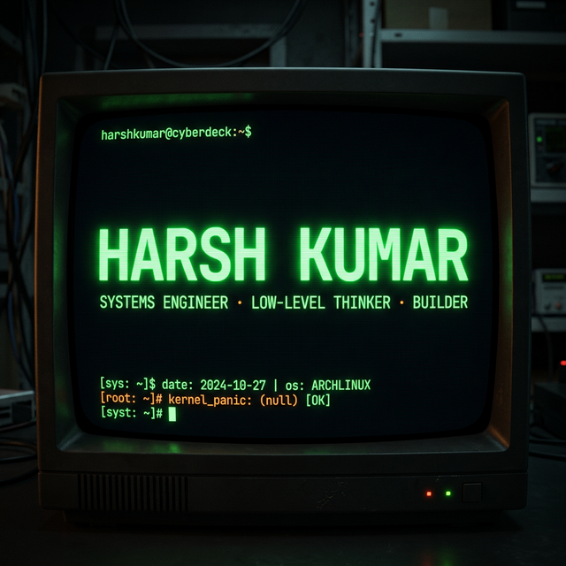

<!-- ░░  H A R S H   K U M A R  ·  h - 9 9 0  ░░ -->

<!-- ═══════════  CRT BANNER  ═══════════ -->

 

<!-- ═══════════  ASCII ART NAME  ═══════════ -->

<pre>
██╗  ██╗ █████╗ ██████╗ ███████╗██╗  ██╗
██║  ██║██╔══██╗██╔══██╗██╔════╝██║  ██║
███████║███████║██████╔╝███████╗███████║
██╔══██║██╔══██║██╔══██╗╚════██║██╔══██║
██║  ██║██║  ██║██║  ██║███████║██║  ██║
╚═╝  ╚═╝╚═╝  ╚═╝╚═╝  ╚═╝╚══════╝╚═╝  ╚═╝
▀▀▀▀▀▀▀▀▀▀▀▀▀▀▀▀▀▀▀▀▀▀▀▀▀▀▀▀▀▀▀▀▀▀▀▀▀▀▀▀
   ░▒▓ SYSTEMS ENGINEER · BUILDER ▓▒░
</pre>

 

<!-- ═══════════  TYPING SVG  ═══════════ -->

 

<!-- ═══════════  RETRO SPECS  ═══════════ -->

---

<h2 align="center">⌬ <code>whoami</code> ⌬</h2>

<table>
<tr><td>
<pre lang="rust">
struct HarshKumar {
    location:       &amp;'static str,
    interests:      Vec&lt;&amp;'static str&gt;,
    currently:      &amp;'static str,
    philosophy:     &amp;'static str,
}

impl HarshKumar {
    fn new() -&gt; Self {
        Self {
            location:   "exploring the stack",
            interests:  vec![
                "philosophy",
                "mathematics",
                "data science",
                "artificial intelligence",
                "low-level programming",
                "system design",
            ],
            currently:  "engineering software at the system level",
            philosophy: "understand the machine — then transcend it",
        }
    }
}
</pre>
</td></tr>
</table>

---

<h2 align="center">⌬ <code>ls ~/toolbox/</code> ⌬</h2>

<h4><code>[ LANGUAGES ]</code></h4>

<h4><code>[ FRAMEWORKS & TOOLS ]</code></h4>

<h4><code>[ DOMAINS ]</code></h4>

---

<h2 align="center">⌬ <code>ls ~/projects/ --featured</code> ⌬</h2>

<table>
<tr>
<td align="center" width="50%">
<h3><a href="https://github.com/h-990/system_synapse">🧠 system_synapse</a></h3>
<code>Rust</code> <code>ZeroMQ</code> <code>egui</code> <code>tokio</code>  
Bio-inspired AI ecosystem — Cortex Citadel (brain), Executor (hand), Nervous System (ZeroMQ bus). Mimics biological neural architecture.
</td>
<td align="center" width="50%">
<h3><a href="https://github.com/h-990/API-Tester">🔬 API-Tester</a></h3>
<code>C++20</code> <code>raylib</code> <code>CMake</code> <code>curl</code>  
Native GUI for auditing LLM APIs across 9+ providers (OpenRouter, Google AI, Mistral, Groq). Cross-compiles via Zig toolchain.
</td>
</tr>
<tr>
<td align="center" width="50%">
<h3><a href="https://github.com/h-990/z-automation">⚡ z-automation</a></h3>
<code>Python</code> <code>AXUI</code>  
macOS system automation — train AI models to control, generate, and automate system-level tasks via Accessibility UI.
</td>
<td align="center" width="50%">
<h3><a href="https://github.com/h-990/online-cheat-detection-main">👁️ online-cheat-detection</a></h3>
<code>Python</code> <code>Flask</code> <code>OpenCV</code> <code>YOLOv8</code>  
AI-powered exam proctoring with real-time face detection (MediaPipe FaceMesh) and violation monitoring.
</td>
</tr>
</table>

---

<h2 align="center">⌬ <code>neofetch --github-stats</code> ⌬</h2>

 

 

---

<picture>
  <source media="(prefers-color-scheme: dark)" srcset="https://raw.githubusercontent.com/h-990/h-990/output/github-snake-dark.svg" />
  <source media="(prefers-color-scheme: light)" srcset="https://raw.githubusercontent.com/h-990/h-990/output/github-snake.svg" />
  
</picture>

---

<h2 align="center">⌬ <code>cat ~/social_links.conf</code> ⌬</h2>

 

<i>"understand the machine — then transcend it"</i>

